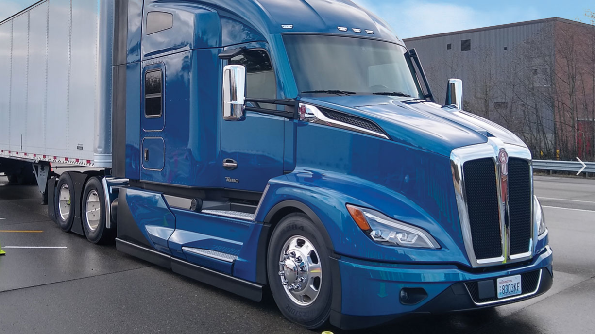
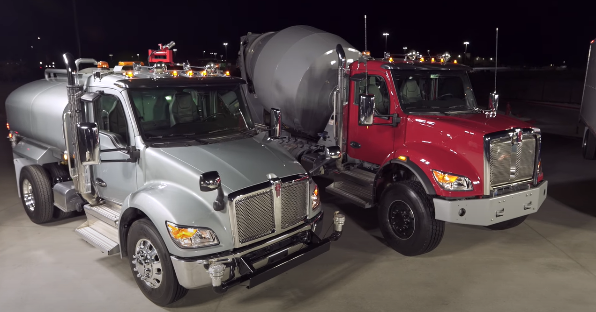
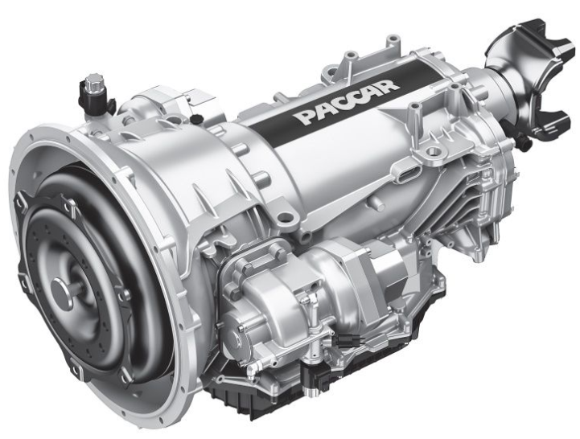
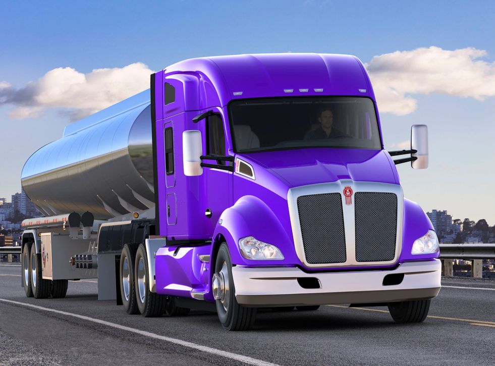

Pablo Montijo

 Sr. Design Engineer
 
 Paccar

# Introduction

 In this document present the projects I've been working on at Paccar and the tasks I have completed.

**T680 Next Gen**

* Implemented frame drilling rules for 168 Transmission - Engine Combinations.
* Released Shift Levers.
* Authored Transmission Selection Rules.
 

#### Figure 1. Shows a T680 Next Gen Truck

**New Medium Duty**

* Released dipstick tubes and bracketry for 26 Transmission - Engine Combinations.
* Created coverage for transmission support installations for 332 Transmission - Engine Combinations.
* Coordinated hydraulic clutch assist installations for manual transmissions to improve performance over legacy product.
* Implemented new clutches compatible with hydraulic clutch assist.
* Authored application compatibility rules.
* Coordinated QFD, FMEA, DVP&R, PSM.
* Coordinated pilot build support.

#### Figure 2. Shows the New Medium Duty Lineup

**TX-8 Transmission**

* Created coverage for power take off installations.
* Designed transmission support brackets and springs.
* Implemented transmission dipstick tubes.
* Authored application compatibility rules.
* Coordinated QFD, FMEA, DVP&R, PSM.
* Coordinated pilot build support.

#### Figure 3. Shows the TX-8 Transmission

**MY21 T680**

* Implemented engineering changes to fix an exhaust pipe-transmission interference issue.

#### Figure 4. Shows a T680 Truck
